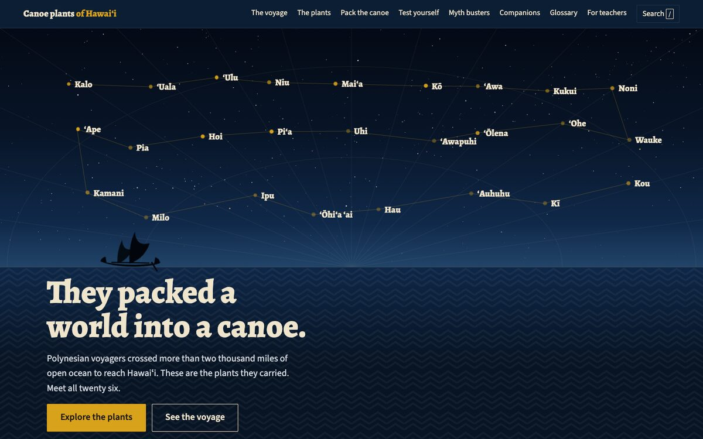
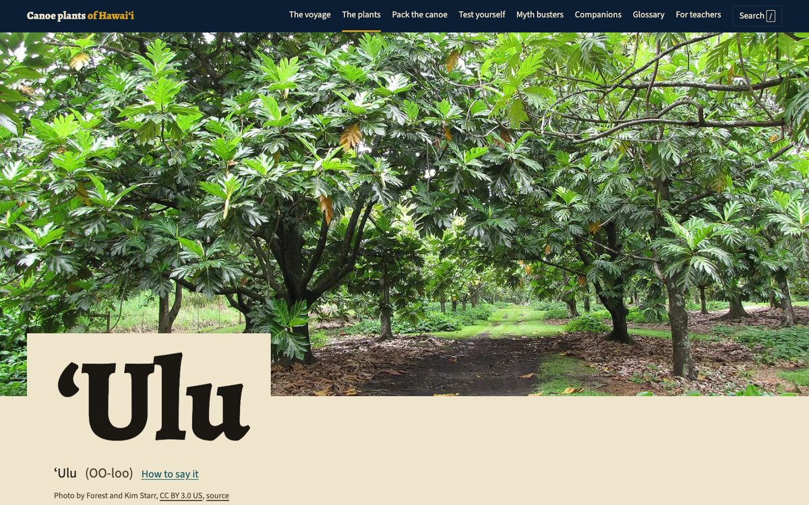

# Canoe plants of Hawaiʻi

An interactive guide to the plants Polynesian voyagers carried across the Pacific to Hawaiʻi in their waʻa. Built for students in grades 5 through 12, their teachers, and anyone curious.

Live site: https://olagon.github.io/canoe-plants/





## What is in it

- **The voyage.** An SVG map of the Pacific with the routes from Taiwan to Hawaiʻi, where each plant started, a timeline, and how we know.
- **The plants.** All 26 plants on one wall with filters by use, plant part, and origin. Search and sort. Filters live in the URL so a teacher can share a link to all the medicine plants.
- **Plant pages.** A field guide page for every plant with uses by plant part, cool facts, a moʻolelo, growing notes, a photo gallery with credits, sources, and a printable fact sheet.
- **Pack the canoe.** A game. Eight slots, 26 plants, six needs to cover.
- **Test yourself.** A quiz that draws ten questions from a pool of sixty.
- **Myth busters.** Plants people think are canoe plants but are not, with a tap game.
- **Voyaging companions, a glossary, and a page for teachers** with lesson ideas.

## Run it locally

There is no build step. Any static file server works.

```bash
python3 -m http.server 8080
# then open http://localhost:8080
```

Opening `index.html` straight from the file system will not work, because browsers block `fetch` and JavaScript modules on `file://` pages.

## How it is put together

Plain HTML, CSS, and JavaScript modules. A few libraries load from CDNs with pinned versions: GSAP with ScrollTrigger (hero), Swiper (galleries), Fuse.js (search), and canvas-confetti (wins).

```
index.html            the shell: nav, footer, search dialog
css/                  tokens, base, components, views, print
js/app.js             boot, nav, search
js/router.js          tiny hash router (#/plants, #/plant/kalo)
js/views/             one module per page
js/components/        quiz engine, canoe game, chips, credits, icons
js/patterns.js        generates the kapa style patterns as SVG
data/                 all the content, as JSON
assets/img/plants/    photos, three sizes each, WebP and JPEG
assets/svg/           icon sprite, canoe, Pacific land shapes
tools/                build time helpers, never loaded by the site
```

All content lives in `data/`. The views only render it.

| File | What it holds |
|---|---|
| `plants.json` | The 26 plants. Every field is required. |
| `sources.json` | Every text source, keyed by id. Facts point to these ids. |
| `credits.json` | Every image credit. Written by `tools/images.py`. Do not edit by hand. |
| `glossary.json`, `quiz.json`, `myths.json`, `companions.json` | What they say. |
| `timeline.json`, `voyage-map.json` | The voyage page. Map coordinates are longitude and latitude. |
| `pack-the-canoe.json` | Scoring and text for the game. |
| `home.json`, `teachers.json` | Copy for those pages. |

## How to add or change a plant

1. Edit its object in `data/plants.json`. Follow the shape of the other entries. `useTags`, `partTags`, and `originMapKey` must use the values listed in `tools/check-data.py`.
2. Every fact needs a `source` id that exists in `data/sources.json`.
3. Add its photos to `tools/image-manifest.json` with the Wikimedia Commons file name, author, license, and alt text. The first image with the role `hero` is the main photo.
4. Run the image tool. It checks the license with Wikimedia, downloads, resizes, and rewrites `credits.json` and the `images` lists.
5. Add scores for the plant in `data/pack-the-canoe.json`.
6. Run the checks.

```bash
python3 tools/images.py       # needs ImageMagick (brew install imagemagick)
python3 tools/check-data.py   # content rules, spelling rules, missing files
python3 tools/contrast.py     # WCAG contrast for every color pair
```

## Hawaiian spelling

The ʻokina is the real character (U+02BB), never an apostrophe. Kahakō are always written. `tools/check-data.py` looks for fakes. The fonts were chosen because they contain these glyphs. See DECISIONS.md.

## Licenses

- Code: MIT. See LICENSE.
- Writing in `data/`: CC BY 4.0.
- Photos: each keeps its own license, all public domain, CC0, CC BY, or CC BY-SA. See the credits page or `data/credits.json`.
- Map land shapes: Natural Earth, public domain.

The plants and traditions described here belong to Hawaiian culture and knowledge. This site is a starting point, not the last word.
